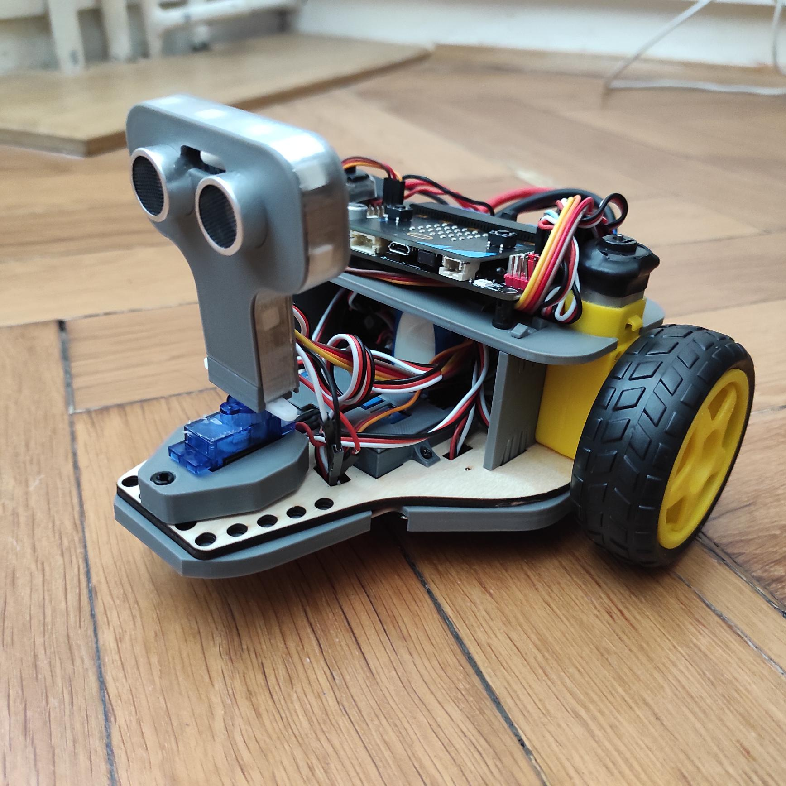
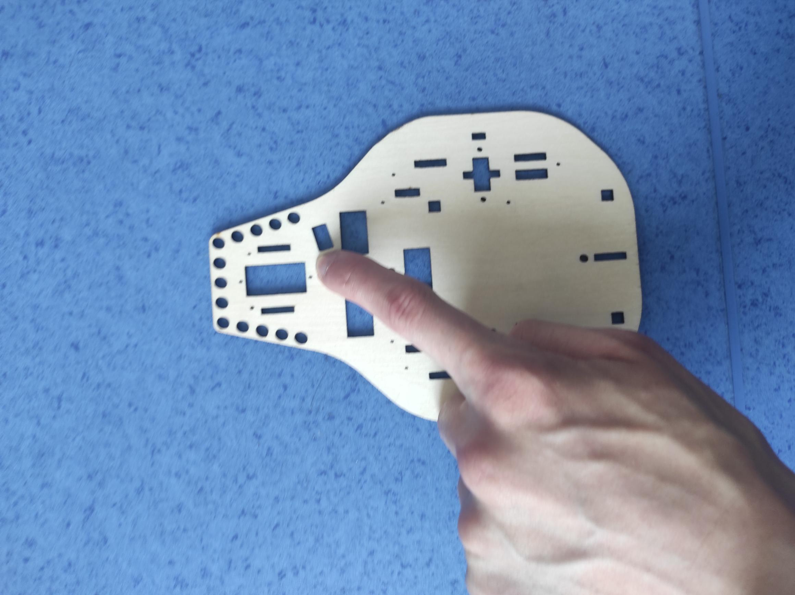
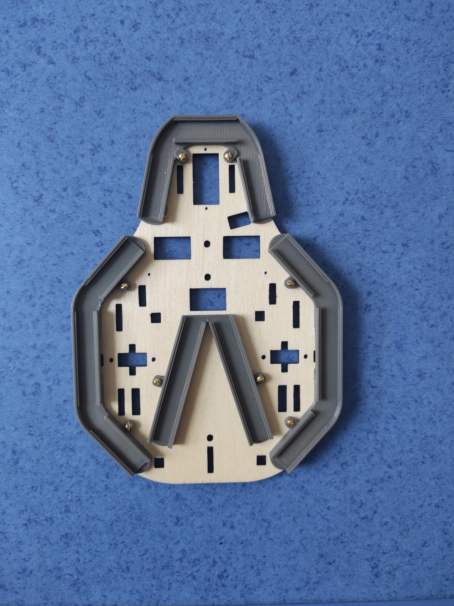
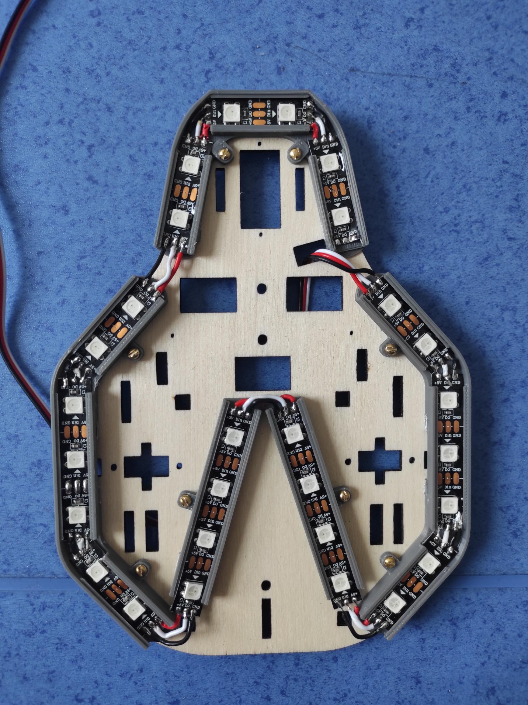
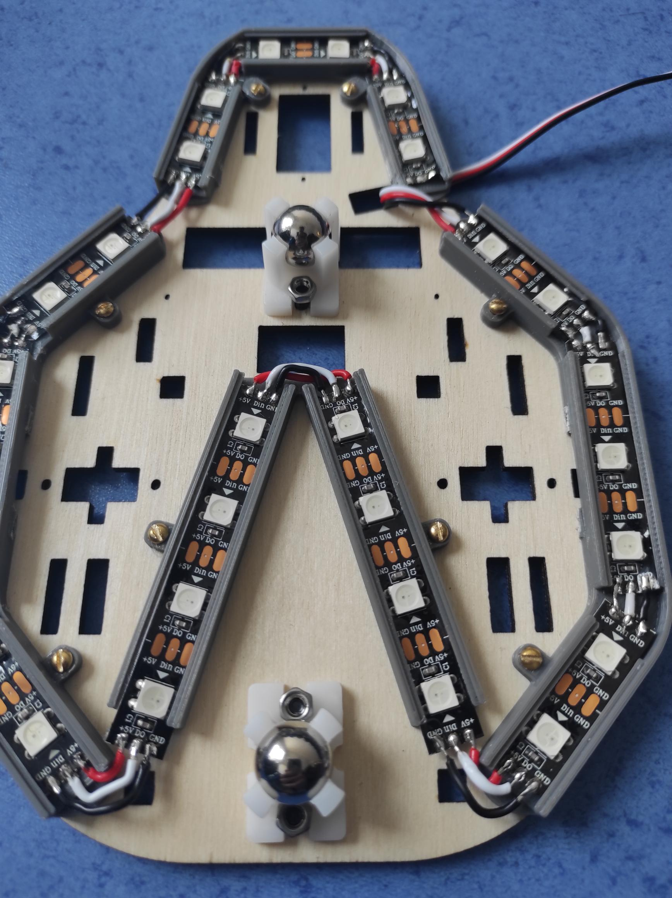
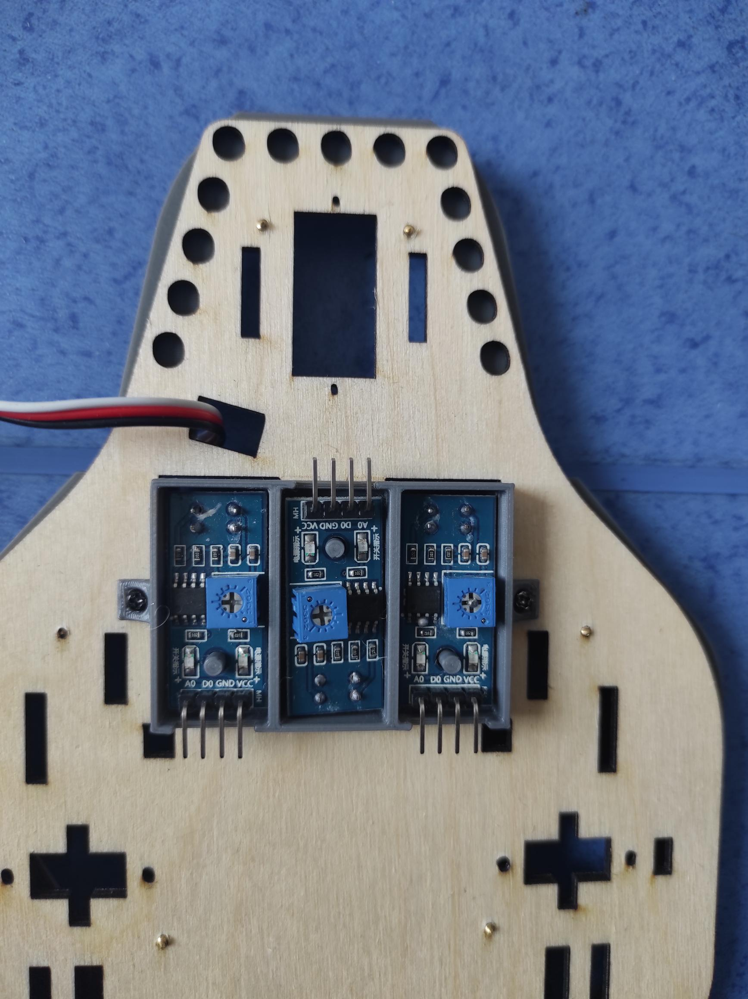
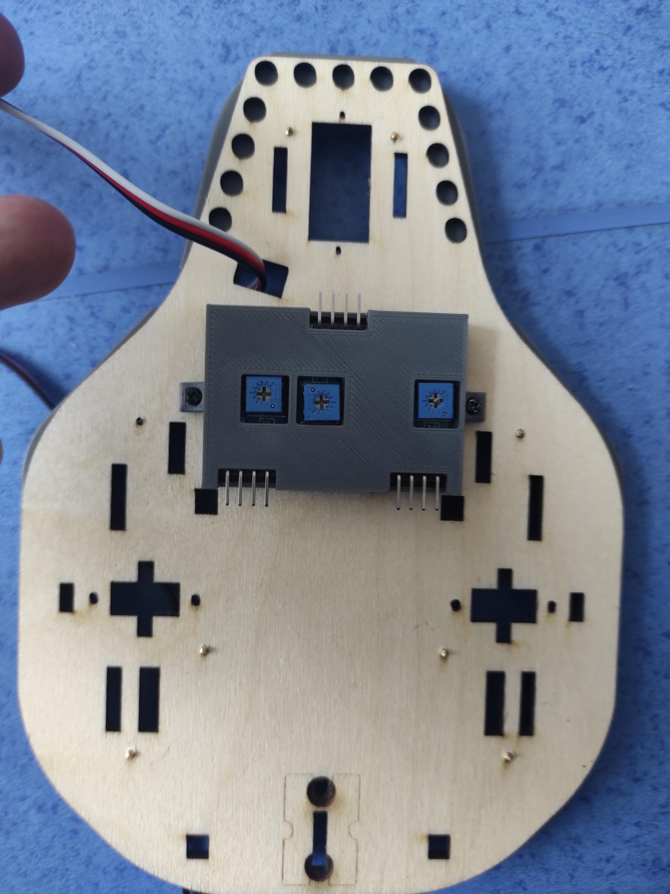
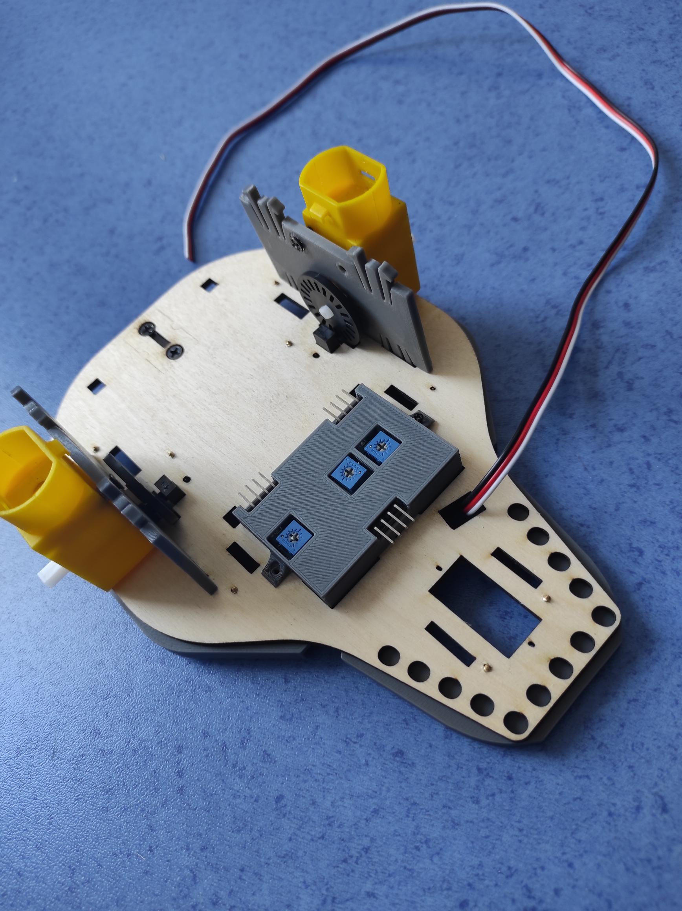

# PeeWee robocar

Vozítko PeeWee RoboCar, je možné vytiskout z domova a programovat pomocí Micro:bitu.
Díky tisknutelnosti dílů se nemusíte bát, neboť si vozítko vytisknete sami.

## Komponenty
Komponenty koupené | Cena
--- | --- 
[Lithiová baterie](https://www.lipolbaterie.cz/103-lipol-lipo-baterie-turnigy-3s-2200mah-20c-11-1v.html)| 523 Kč
[2x Motor](https://www.specialni-naradi.cz/motorek-3-6v/0-17a-s-prevodovkou-prevod-1/48)| 122 Kč
[3x IR senzor](https://www.laskakit.cz/arduino-ir-opticky-infra-snimac-fc-51/)| 84 Kč
[2x IR wheel senzor](https://www.makerstore.com.au/product/robo-sensor-speed/)| 130 Kč
[LED páska](https://www.mall.cz/led-pasky/ledsoft-ws2812b-led-pasek-18w-m-ip20-100084347241) | 175 Kč
[Motor:Bit](https://www.aliexpress.com/i/4000834837807.html)| 687 Kč
[Lego plugy](https://www.malekostky.cz/Lego-Technic-pin-cerny-sada-10ks-d2803.htm)| 2 Kč

Komponenty tisknuté |
--- |
[2x LED holder postranní](./sorce/Side_LED_holder.SLDPRT)  |
[LED holder přední](./source/Front_LED_holder.SLDPRT)  |
[LED holder vnitřní](./source/Middle_LED_holder.SLDPRT) |
[Senzorový box](#) |
[Senzorové víko](#) |
[2x Bočnice](./source/Side_holder.SLDPRT) |
[Držák na baterii](#) |

Komponenty gravírovanné |
--- |
Základní deska |

## Cena
Cena se může velice lišit podle dovozu,
ale po součtu cen v tabulce nahoře je cena <b>~1723 Kč</b>.

Ovšem do této ceny není započten filament z tisku, gravírování, vruty atd.

## Příprava komponent
### 3D Tisk
1. Stahnout si soubory -
Stáhněte si ze složky **./printfiles**, zde najdete soubor **All.std** .
2. Samotný tisk -
Soubor **All.std** otevřete ve volitelné aplikaci pro 3D tisk. 
Tisk By měl trvat kolem 5h 30min.
3. Sejmutí dílků -
Z plochy na výtisk odejměte jednotlivé dílky a očistěte držák na baterii od podpěr.

### 4. Zakladní deska
Narozdíl od ostatních komponent je základní deska z překlišky, proto je nutné ji vygravírovat.
1. Stáhnetě si soubor **./pieces/MotherBoard**
2. Otevřte ve volitelném programu pro gravírování vámi staženého souboru
3. Dejte gravírovat
4. Gravírování může trvat zhruba 3h 30min
5. Vyjměte vámi vygravírovanou překližku

## Sestavení
1. Zkontrolujte si že tento otvor je levé straně

 

### 1. LED holder
Vezměte jednotlivé LED holdery a umístěte jejich otvory na vruty nad otvory v hlavní desce jako na obrázku.
Do každého otvoru umístěte vrut o průměru cca M2.2x6.5 jako na obrázku.
Každý držák na LED vrutem přišroubujte.

### 2. Pájení LED
Nastříhejte si z LED pásku následovně:
* 2x 3 LED
* 7x 2 LED
* 2x 4 LED
Osadtě a připájejte jako na obrázku

### 3. Spodní kolečka na držení
1. Nahoru do 2 otvorů dejte šrouby M3x8, zespoda dejte ocelovou kuličku a upevněte maticí
2. Do udělejte pro obě kuličky

### 4. IR box
1. umístěte IR box do těchto tří otvorů
2. Přišroubujte IR box k desce pomocí dvou vrutů M1.7x4
3. Vložte IR senzory do boxu.
4. Přicvakněte horní kryt.

### 5. Motory
1. Ze spoda upevněte IR senzory pro měření otáčení zespoda vruty M2.5x8
2. Do dřevěné desky zacvakněte obě bočnice
3. Motory zastrčte spodem do základní desky a přišroubujte do bočnice škouby M3x8
4. Na tyčku motorů upevněte plastové kolečko

5. Nakonec přicvakněte horní panel na bočnice
   
### 6. Zapojení
Vezměte Motor:Bit a umístěte jej na horního panelu pomocí lego plugů. 
Pozapojujte následovně:
Součast | Pin
--- | ---
Levý motor | M1
Pravý motor | M4
Levý IR senzor | P14
Střední IR senzor | P15
Pravý IR senzor | P13
Levý wheel encoder | P12
Pravý wheel encoder | P8
LED | P0
   
### 7. Testování 
1. Nahrajte tento kód do vašeho microbitu
2. Vložte váš Micro:Bit do Motor:Bitu

Poznámka: Pokud se vozítko chová jinak, museli jste někde udělat chybu a zkontrolujte tak vozítko podle předešlé části manuálu.

## Author
[@LukasChaloupecky](https://github.com/LukasChaloupecky)
