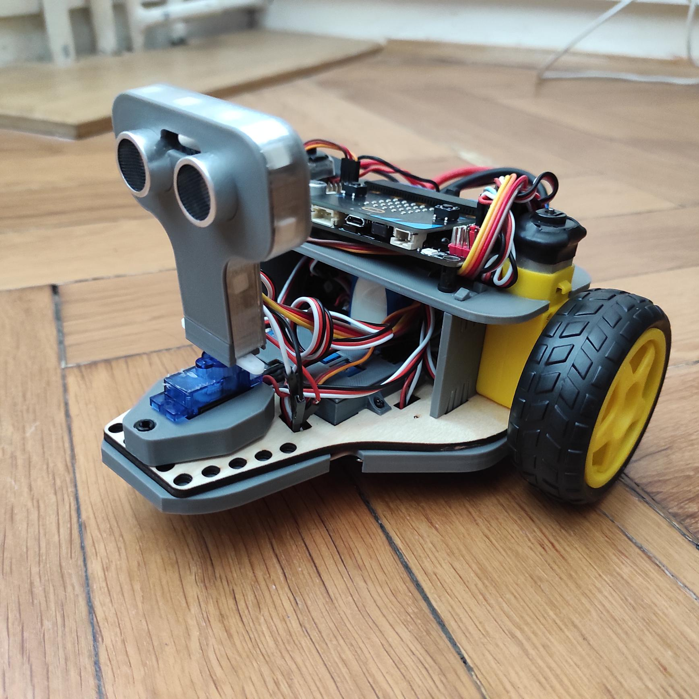
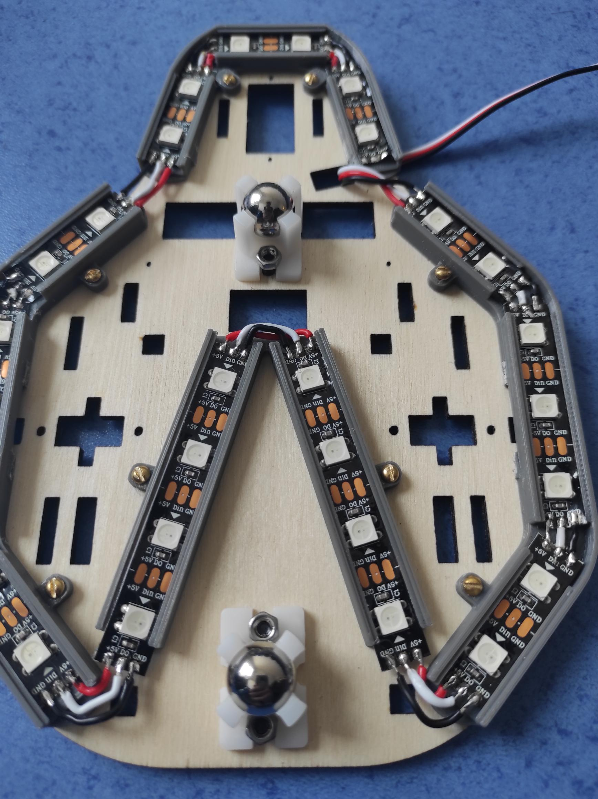
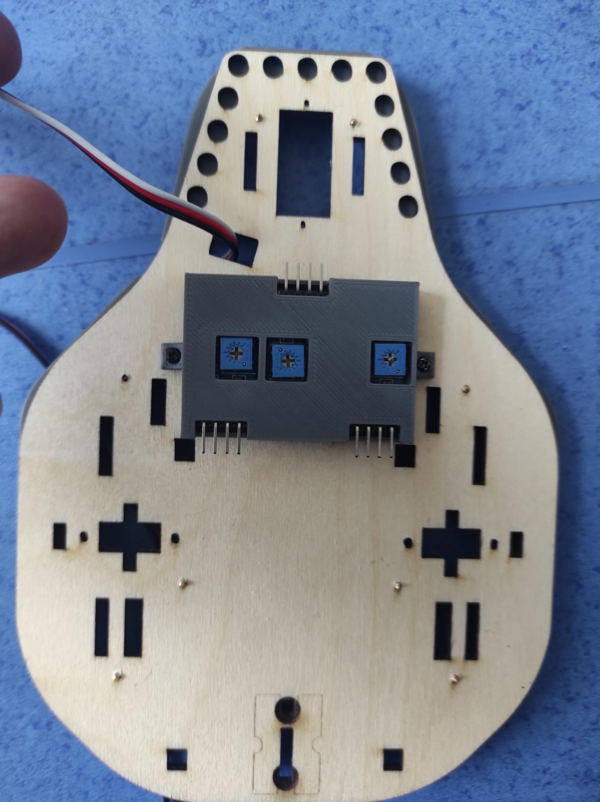
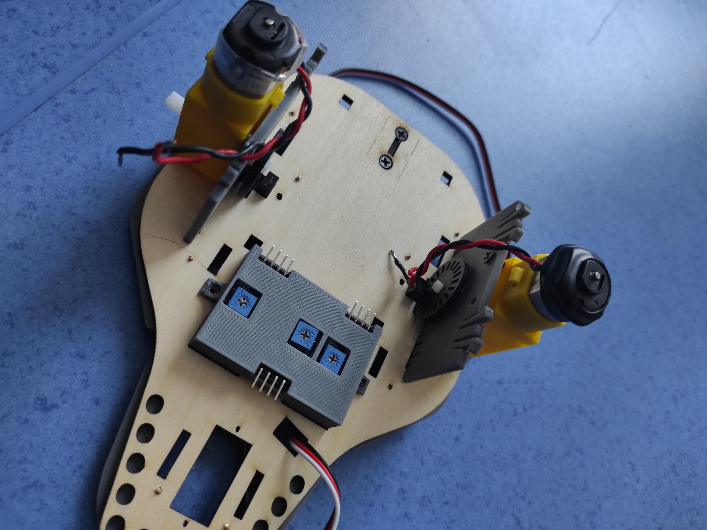

# PeeWee robocar

The PeeWee RoboCar can be printed from home and programmed using a Micro:bit.
Thanks to the printable parts, you don't have to worry, because you can print the cart yourself.

## Price
The price can vary greatly depending on the import,
but after adding up the prices in the table above, the price is <b>~79.65 USD.</b>.

However, this price does not include filament from printing, engraving, screws, etc.

## Components
Components purchased | Price
--- | ---
[Lithium battery](https://www.lipolbaterie.cz/103-lipol-lipo-baterie-turnigy-3s-2200mah-20c-11-1v.html)| 24.14 USD
[2x Motor](https://www.specialni-naradi.cz/motorek-3-6v/0-17a-s-prevodovkou-prevod-1/48)| 5.63 USD
[3x IR sensor](https://www.laskakit.cz/arduino-ir-opticky-infra-snimac-fc-51/)| 3.88 USD
[2x IR wheel sensor]([./](https://www.makerstore.com.au/product/robo-sensor-speed/))| 6.00 USD
[LED strip](https://www.mall.cz/led-pasky/ledsoft-ws2812b-led-pasek-18w-m-ip20-100084347241) | 8.09 USD
[Engine:Bit](https://www.aliexpress.com/i/4000834837807.html)| 31.72 USD
[Lego plugs](https://www.malekostky.cz/Lego-Technic-pin-cerny-sada-10ks-d2803.htm)| 0.09 USD

Components printed |
--- |
[2x LED holder side](./sorce/Side_LED_holder.SLDPRT/) |
[LED holder front](./source/Front_LED_holder.SLDPRT) |
[LED holder middle](./source/Middle_LED_holder.SLDPRT) |
[Sensor box](#) |
[Sensor Cover](#) |
[2x Sidewalls](./source/Side_holder.SLDPRT) |
[Battery holder](#) |

Engraved components |
--- |
[Motherboard](./sorce/Mother_board.SLDPRT)|

## Preparation of components
### 3D Printing
1. Download the files -
Download from **./printfiles** folder, here you will find file **All.std** .
2. The print itself -
Open the **All.std** file in an optional 3D printing application.
Printing should take around 5h 30min.
3. Removing the parts -
Remove the individual parts from the print surface and clean the battery holder from the supports.

### 4. Motherboard
Unlike the other components, the base plate is made of plywood, so it is necessary to engrave it.
1. Download the file **./pieces/MotherBoard**
2. Open the file you downloaded in your optional engraving program
3. Let it be engraved
4. Engraving can take approximately 3 hours 30 minutes
5. Remove the plywood you have engraved

## Build
1. Check that this opening is on the left side

 

### 1. LED holder
Take the individual LED holders and place their screw holes over the holes in the main board as shown.
Place a screw with a diameter of approx. M2.2x6.5 in each hole as shown in the picture.
Screw each LED holder with a screw.

### 2. Soldering the LED
Cut your LED strip as follows:
* 2 x 3 LEDs
* 7x 2 LEDs
* 2 x 4 LEDs
Mount and solder as shown

### 3. Bottom wheels for holding
1. Put M3x8 screws in 2 holes at the top, put a steel ball at the bottom and fix with a nut
2. Do for both balls

### 4. IR box
1. place the IR box in these three holes
2. Screw the IR box to the board using two M1.7x4 screws
3. Insert the IR sensors into the box.
4. Snap on the top cover.

### 5. Engines
1. Fix the IR sensors for measuring rotation from below with M2.5x8 screws
2. Snap both sides into the wooden board
3. Insert the motors into the base plate from below and screw M3x8 screws into the side
4. Attach the plastic wheel to the motor rod

6. Finally, snap the top panel to the sides
   
### 6. Engagement
Take the Motor:Bit and place it on the top panel using the lego plugs. 
Disconnect as follows:
Part of | Pin
--- | ---
Left engine | M1
Right engine | M4
Left IR Sensor | P14
Mid IR Sensor | P15
Right IR Sensor | P13
Left wheel encoder | P12
Right wheel encoder | P8
LEDs | P0
   
### 7. Testing
1. Upload this code to your microbit
2. Insert your Micro:Bit into the Motor:Bit

Note: If the cart behaves differently, you must have made a mistake somewhere, so check the cart according to the previous part of the manual.

## Author
[@LukasChaloupecky](https://github.com/LukasChaloupecky)
